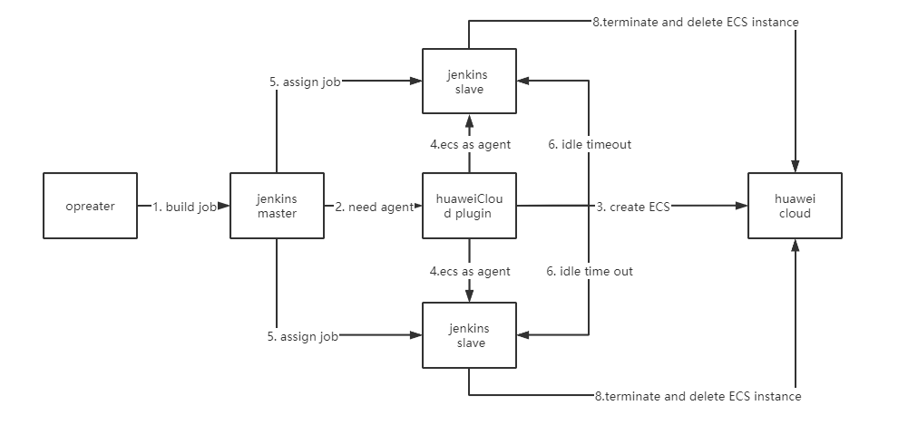

# HuaweiCloud ECS plugin

# 目录

 * [介绍](#introduction)
 * [用法](#usage)

## 介绍 <a id ="introduction"/>

该插件实现jenkins从节点自动弹性伸缩机制，在jenkins超负载的时候调用华为云ECS API启动实例，并自动将创建的实例作为jenkins的代理进行链接。当负载下降时，多余的ECS实例将被终止并释放。

下图说明了该插件的运行机制：

 

## 使用<a id="usage"/>

### 前置条件

开始使用之前，您应具备以下条件：

1. [华为云账号](https://auth.huaweicloud.com/authui/login.html?service=https://console.huaweicloud.com/ecm/#/login)

2. [华为云 AccessKey/SecretKey](https://support.huaweicloud.com/devg-apisign/api-sign-provide-aksk.html)

   

3. 创建密钥对用于建立SSH连接

   

## Issues

TODO Decide where you're going to host your issues, the default is Jenkins JIRA, but you can also enable GitHub issues,
If you use GitHub issues there's no need for this section; else add the following line:

Report issues and enhancements in the [Jenkins issue tracker](https://issues.jenkins-ci.org/).

## Contributing

TODO review the default [CONTRIBUTING](https://github.com/jenkinsci/.github/blob/master/CONTRIBUTING.md) file and make sure it is appropriate for your plugin, if not then add your own one adapted from the base file

Refer to our [contribution guidelines](https://github.com/jenkinsci/.github/blob/master/CONTRIBUTING.md)

## LICENSE

Licensed under MIT, see [LICENSE](LICENSE.md)

